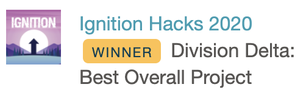

# Peerify

Peerify is a game-based learning platform that turns study sessions into an exciting social experience.

Made by [@zxyl](https://github.com/zxyil), [@Zandew](https://github.com/Zandew) and [@jjjding2](https://github.com/jjjding2) at Ignition Hacks 2020.

Demo here: https://www.youtube.com/watch?v=hsLmO2bPO3I

Backend: https://github.com/Zandew/Peerify-backend

### Built with:

    
    
    
    
    
    
    
    

